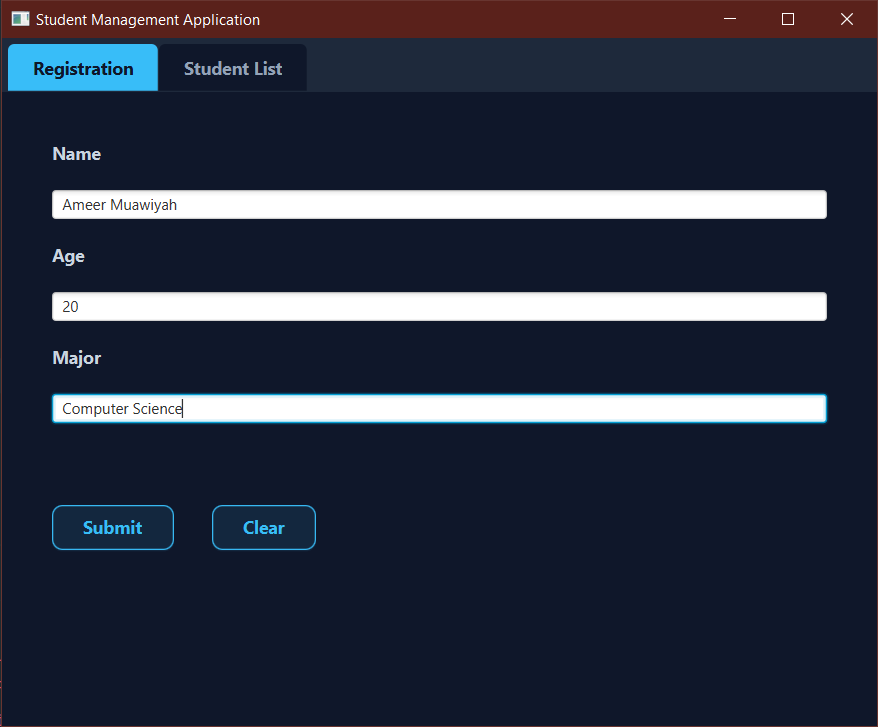
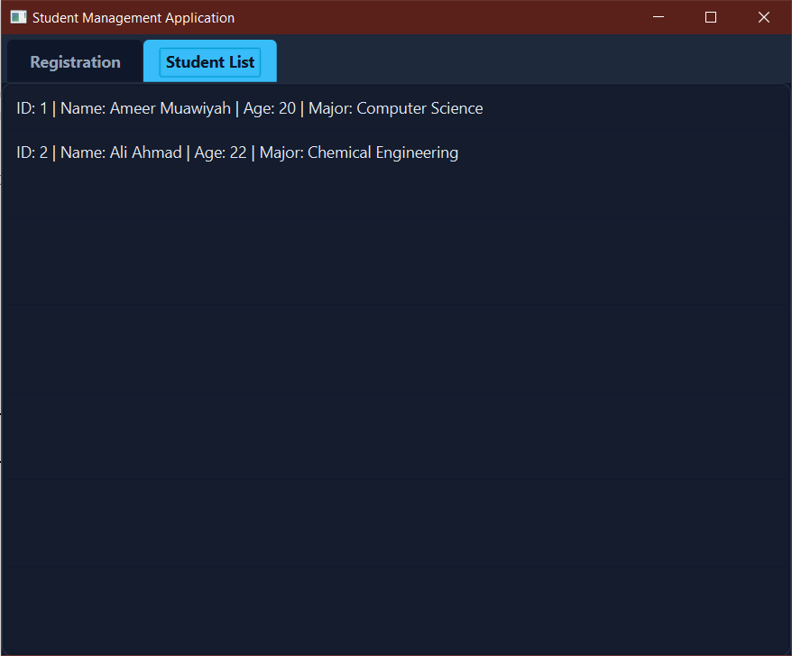

# Student Management System

A desktop application built with JavaFX demonstrating a complete Model-View-Controller (MVC) architecture, Data Access Object (DAO) patterns, and seamless MySQL database integration. Developed as part of the Object-Oriented Programming coursework at UET Peshawar.

### 📸 Screenshots




### ✨ Features
* **Persistent Data Storage:** Fully integrated with a local MySQL database to ensure data survives after the application closes.
* **Complete CRUD Operations:** Safely Create, Read, Update, and Delete student records directly from the database using JDBC.
* **Strict MVC & DAO Architecture:** Clean separation of data logic, visual layout, and input control.
* **Modern UI/UX:** Custom CSS implementation featuring a dark theme and custom input styling.
* **Input Validation:** Prevents empty submissions, validates numeric inputs, and utilizes `try-with-resources` to prevent memory leaks.
* **Dynamic Data Binding:** Utilizes `ObservableList` to instantly update the UI when new data is pulled from the database.

### 🛠️ Technologies Used
* Java 21+
* JavaFX & FXML (Scene Builder)
* MySQL 8.0+
* JDBC (`mysql-connector-j` 8.3.0)
* Maven

### 🗄️ Database Setup
To run this application locally, you must set up the database first. Run the following SQL script in MySQL Workbench:

```sql
CREATE DATABASE student_management;
USE student_management;

CREATE TABLE students (
    id INT PRIMARY KEY AUTO_INCREMENT,
    name VARCHAR(100) NOT NULL,
    age INT,
    major VARCHAR(100)
);