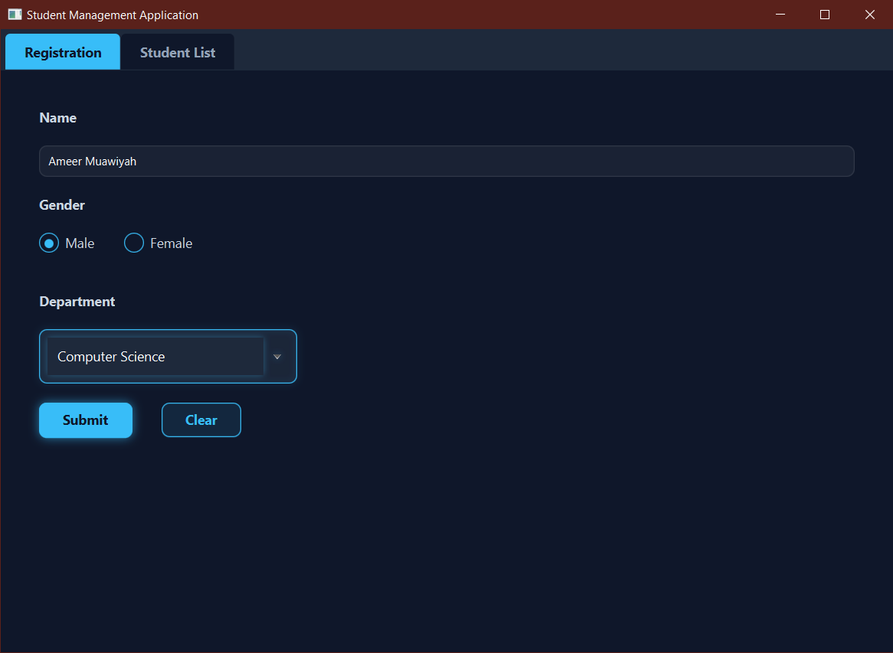
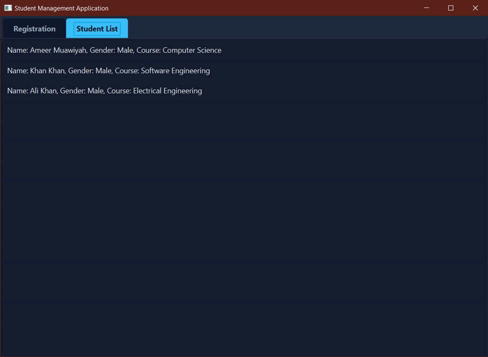

# Student Management System

A desktop application built with JavaFX demonstrating a complete Model-View-Controller (MVC) architecture.

### 📸 Screenshots

### ✨ Features
* **Strict MVC Architecture:** Clean separation of data logic, visual layout, and input control.
* **Modern UI/UX:** Custom CSS implementation featuring a dark theme and custom input styling.
* **Input Validation:** Prevents empty submissions and provides real-time user feedback.
* **Dynamic Data Binding:** Utilizes `ObservableList` to instantly update the UI when new data is added.

### 🛠️ Technologies Used
* Java 21+
* JavaFX
* FXML (Scene Builder)
* Maven

### 🚀 How to Run
1. Clone the repository.
2. Open the project in IntelliJ IDEA.
3. Reload the Maven project to sync dependencies.
4. Run `Launcher.java` to bypass module restrictions and launch the application.